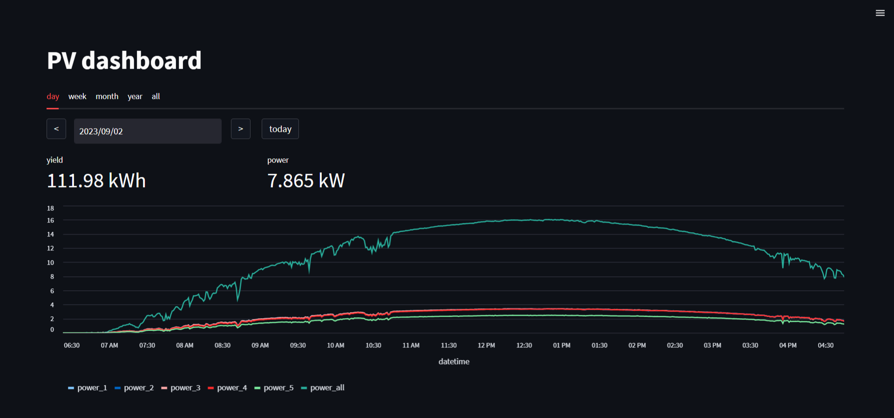
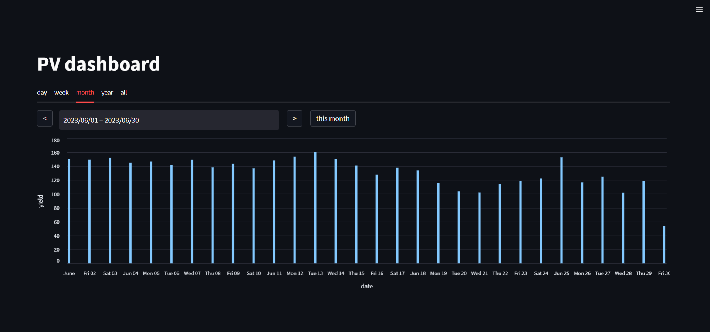

# pv-dashboard

Custom made logging and monitoring of photovoltaic system

* logging via RS485
* database: sqlite3
* dashboard: streamlit

## specs
### PV system
* peak performance: 24.4 kWp
* panels: 132x Schüco MPE 185 MS 06 (185W)
* inverter: 4x Schüco SGI 4500 plus, 1x Schüco 3500 T plus 02
* commissioning date: 2011

### hardware
* Banana Pi BPI-M1 with armbian
* RS485 to USB converter: YYH-256 (MAX485, CH340)

## knowledge pool
* [TechCrawler - dd-wrt Logger per RS-485 an Kaco Wechselrichter](https://web.archive.org/web/20180423200510/http://techcrawler.riedme.de/2011/09/25/dd-wrt-logger-per-rs-485-an-kaco-wechselrichter/)
* [photovoltaikforum - RS485 Protokoll KACO Powador Wechselrichter](https://web.archive.org/web/20151217143954/http://www.photovoltaikforum.com/datenlogger-f5/rs485-protokoll-kaco-powador-wechselrichter-t24143-s80.html#p562493)
* [plieningerweb/kacors485](https://github.com/plieningerweb/kacors485)